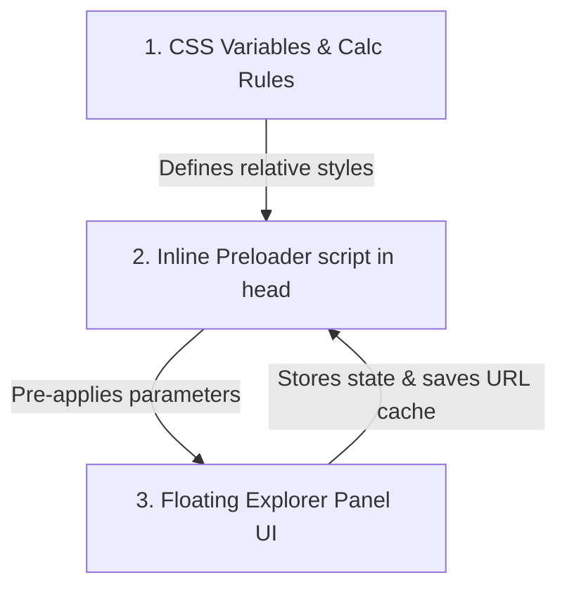

# Omni DevTools

## Overview
**Omni DevTools** is a design and development pattern for building floating, dynamic, and non-destructive experimentation panels exclusive to development branches. They allow creators, designers, and developers to tweak visual variables (fonts, weights, sizes, margins, color palettes) live in the browser, instantly seeing the impact across the entire project before writing code.

---

## When to Use

### Use when:
- Exploring new typographic systems (like changing Google Fonts, scaling sizes, or shifting weights globally).
- Toggling decorative features (like italics, underlines, borders, or glassmorphic cards).
- Tuning visual balances live with stakeholders (e.g. adjust scales, colors, or micro-spacings) without waiting for fresh builds.
- Preserving the exploration state across refreshes without making permanent changes to the production stylesheet.

### When NOT to use:
- Production branches (these tools are exclusively dev-branch utility panels and must not compile to client bundles).
- Backend or logical database experimentation.

---

## Core Pattern Architecture

A complete Omni DevTool follows a three-layered design system:



### 1. The CSS Variables Layer
Instead of hardcoding styling parameters, map typography, weights, and scales to computed variables in the core theme stylesheet:
- **Base Variable Definitions**:
  ```css
  :root {
    --font-display-scale: 1;
    --font-display-weight-offset: 0;
    --font-display-style: italic;
  }
  ```
- **Relative calculations in utility classes**:
  ```css
  .type-display {
    font-size: calc(clamp(3.1rem, 5.9vw, 5rem) * var(--font-display-scale, 1));
    font-weight: calc(300 + var(--font-display-weight-offset, 0));
    font-style: var(--font-display-style, italic);
  }
  ```

### 2. The Non-Blocking Preloader Layer
To prevent Layout Shift (CLS) or a Flash of Unstyled Text (FOUT) on refresh, include an inline `<script is:inline>` at the very top of the page's `<head>` that parses parameters from `localStorage` and applies variables before the browser renders the page:
```javascript
(() => {
  try {
    const stored = window.localStorage.getItem("omni-font-explorer");
    if (stored) {
      const settings = JSON.parse(stored);
      // Pre-apply scale and weight properties
      if (settings.serifScale) document.documentElement.style.setProperty("--font-display-scale", settings.serifScale);
      if (settings.serifWeightOffset) document.documentElement.style.setProperty("--font-display-weight-offset", settings.serifWeightOffset);
      if (settings.serifItalic !== undefined) document.documentElement.style.setProperty("--font-display-style", settings.serifItalic ? "italic" : "normal");
      
      // Inject proven stylesheet immediately (avoiding runtime fallbacks at load time)
      if (settings.serifLoadedUrl) {
        const link = document.createElement("link");
        link.id = "font-link-serif-explorer";
        link.rel = "stylesheet";
        link.href = settings.serifLoadedUrl;
        document.head.appendChild(link);
      }
    }
  } catch (e) {
    console.error("DevTools preloader failed:", e);
  }
})();
```

### 3. The Explorer Panel UI Layer
Provide an elegant, collapsible floating glassmorphic container with input controls, range sliders, and active script controllers.

---

## Font Studio Implementation Details

The core reference tool inside **Omni DevTools** is the **Font Studio**. It contains two critical sub-systems designed to solve common web exploration problems:

### A. The Safe Google Font Fallback Loader
Google Fonts v2 API is extremely strict. If you request a variable range like `ital,wght@0,100..900;1,100..900` for a static font (like *Cinzel* or *Roboto* static), the server will return a **400 Bad Request**, causing the site to fall back to generic serif/sans-serif.

To resolve this, Font Studio uses a progressive, background loader script that automatically cycles through optimal to basic configuration strings using dynamic stylesheet `<link>` onload/onerror events:

```javascript
function loadFontWithFallbacks(familyName, isSerif, onComplete) {
  const serifVariants = [
    "ital,wght@0,100..900;1,100..900", // 1. Variable Axis + Italics (Lora, Playfair Display)
    "wght@100..900",                  // 2. Variable Upright (Cinzel)
    "ital,wght@0,300;0,400;0,500;0,600;0,700;0,800;0,900;1,300;1,400;1,500;1,600;1,700;1,800;1,900", // 3. Explicit static weights + italics
    "wght@100;200;300;400;500;600;700;800;900", // 4. Explicit static upright
    "ital,wght@0,300;0,400;0,700;1,300;1,400;1,700", // 5. Basic static + italics
    "wght@300;400;700",              // 6. Basic upright
    ""                               // 7. Raw default family name
  ];
  
  const variants = isSerif ? serifVariants : sansVariants;
  let index = 0;
  
  function tryNext() {
    if (index >= variants.length) {
      onComplete(null, null);
      return;
    }
    
    const variant = variants[index];
    const familyParam = familyName.replace(/\s+/g, "+");
    const url = `https://fonts.googleapis.com/css2?family=${familyParam}${variant ? ':' + variant : ''}&display=swap`;
    
    const tempLink = document.createElement("link");
    tempLink.rel = "stylesheet";
    tempLink.href = url;
    
    tempLink.onload = () => {
      // Swap active stylesheet with temporary one
      const oldLinkId = isSerif ? "font-link-serif-explorer" : "font-link-sans-explorer";
      const oldLink = document.getElementById(oldLinkId);
      tempLink.id = oldLinkId;
      if (oldLink) oldLink.remove();
      onComplete(tempLink, url);
    };
    
    tempLink.onerror = () => {
      tempLink.remove();
      index++;
      tryNext(); // Try the next safest fallback variant
    };
    
    document.head.appendChild(tempLink);
  }
  
  tryNext();
}
```
*Note: The successful URL is immediately cached in localStorage (`settings.serifLoadedUrl`). Subsequent page loads can thus request the correct working link immediately without needing any runtime checks.*

### B. The Undo / Redo Design History Stack
Toggling designs requires immediate comparisons. To facilitate this without cluttering storage or freezing browsers, manage state history using an array and a pointer stack.
- **Event separation (Critical)**:
  - Trigger styling updates and display labels live on the `input` event of range sliders for real-time responsiveness.
  - Push values to the history stack only on `change` events (e.g. mouseup of range sliders, preset dropdown select, clicking Apply, or clicking Reset). This prevents a single slider drag from inserting hundreds of micro-states.
- **History controller structure**:
  ```javascript
  let historyStack = [];
  let historyIndex = -1;
  let isApplyingHistory = false;

  function pushToHistory() {
    if (isApplyingHistory) return;
    const state = getPanelState(); // Returns active families, scales, offsets, and styles
    
    // Truncate undone future if pushing a new action mid-stack
    historyStack = historyStack.slice(0, historyIndex + 1);
    historyStack.push(state);
    historyIndex = historyStack.length - 1;
    updateHistoryButtons();
  }

  function applyHistoryState(state) {
    if (!state) return;
    isApplyingHistory = true;
    
    // Update HTML Inputs, Sliders, and CSS Custom Properties
    // ...
    
    isApplyingHistory = false;
  }
  ```

---

## Active Reference Files in this Workspace
To inspect complete, production-grade implementations of the dev-tool components and script hooks, view:
1. **Tool Component Markup & Scripts**: [FontExplorer.astro](file:///Users/hanny/dev/projects/omnidesign-io/src/components/theme/FontExplorer.astro)
2. **Head Loader script & pre-application**: [BaseLayout.astro](file:///Users/hanny/dev/projects/omnidesign-io/src/layouts/BaseLayout.astro)
3. **Dynamic variables & calculated weights**: [global.css](file:///Users/hanny/dev/projects/omnidesign-io/src/styles/global.css)

---

## Common Mistakes & Pitfalls

### 1. Flooding the history stack
- **Mistake**: Binding `pushToHistory()` to the `input` event on sliders.
- **Fix**: Bind variables and label text updates to `input` for fluid, real-time drawing, but bind `pushToHistory()` to `change` for design state checkpoints.

### 2. Loading fallbacks on head parse
- **Mistake**: Putting the recursive load fallback loop inside the inline script in `<head>`.
- **Fix**: The preload script must stay extremely lightweight (<2ms execution). Simply read the validated, proven URL (`serifLoadedUrl`) directly from the cache. The recursive loader must run purely asynchronously inside the main explorer script block.

### 3. Displaying inputs conditionally
- **Mistake**: Forcing users to toggle a custom input field through two different dropdown states.
- **Fix**: Keep custom font name input text boxes permanently visible. Place quick-select "Presets" select elements immediately adjacent to them, letting presets simply populate the textbox on change.
